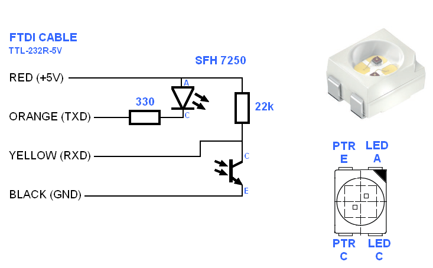
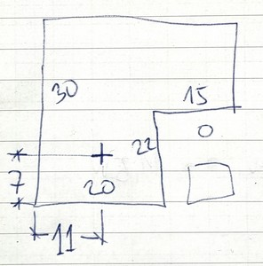

# Infrared cable 

To connect WPM or WPM2 control unit to the external unit, you need to convert optical signals to the electronic signals.
There are a few options to build a "proper" cable, with transistors and opamps. But since the speed is really slow (2400 baud) and cables are short, it is possible to make a simplified version.

### Bill of materials:

- IR transceiver chip [Osram SFH 7250](https://www.google.com/search?q=osram%20SFH%207250&tbm=isch&source=lnms)
- Resistors: 22k and 330 ohm
- Cable [FTDI TTL-232R-5V or TTL-232R-5V-WE](https://ftdichip.com/products/ttl-232r-5v/)

### Schematic:

#### Additional information

 1. The FTDI cable already has 270 ohm resistor built in series with the TXD signal.

 2. The Heat Pump Monitor software also controls the RTS signal (green wire) that can be used to drive a regular LED for the indication of when the communication with the heat pump is in progress.

 3. If connecting to other circuits that have 3.3 V supply and I/O pins (for example ESP32), it might be necessary to adjust resistors and recalculate for the maximum current that is available on it's TXD pin. If max current is too low, additional transistor will be needed.
 
 4. Do not extend the FTDI cable. The RX circuit is very weak and sensitive to noise and other disturbances. Do not place the cable near other power cables. Otherwise you might get spikes in the data or Checksum errors due to the long cable. If longer cable is needed, it is better to reduce the FTDI cable and use the USB extension cable.

### PCB design and IR chip placement
The IR chip does not need to be fully plugged into the hole of WPM2, I have it on the PCB outside in front of the hole and works fine. It is advisable to make a L-shaped PCB with removed space for the settings button and LED on the WPM. I have placed this directly onto the WPM2. 

### Testing the cable
First verify that cable is working as expected. Use any Serial Terminal software, set baud rate to 2400 and send random characters. Same string must be received back, because IR transmitter and receiver are in the same package.
Then run the Heat Pump Monitor software, and select Connect. A few loopback tests will be performed even without the WPM unit nearby.

# Protocol details
If you want to know now it works, enable the Debug checkbox and it will write all the communication that is happening. Also have a look at the Protocol documentation folder, this is where I have put all knowledge about communication.

UART settings are: 2400 baud, 8 bits, Even parity, 2 stop bits.

One stream of bytes is sent with marked transmitter and receiver ID, circuit number, read/write request, register address, data value and checksum.
Then WMP2 returns data in the same format, with transmitter and receiver reversed and actual measured data.

RX on the UART sees both, transmission and reception.
"IR Loopback" tests presence and working of the IR chip. 
IR LED sends out data and IR receiver in the same package sees that data being emitted and returned (echo).
UART TX is TX data.
UART RX is TX data echo + response from WPM2.
